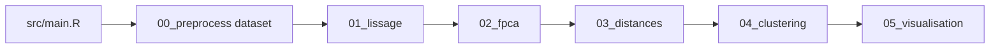

# Audit projet — documentation, code, écarts connus

**Date** : mars 2026. Complète [`STATE_OF_PROJECT.md`](../STATE_OF_PROJECT.md) par une **cartographie** et des **écarts** repérés lors de l’implémentation du plan « rapport de stage + ménage ».

---

## 1. Documentation (`docs/`)

| Fichier | Rôle | Rapport de stage |
|---------|------|------------------|
| [`rapport_synthese.tex`](rapport_synthese.tex) | Synthèse longue, multi-datasets, paradoxe | Référence chiffres/figures, pas copie intégrale |
| [`revue_rapport_synthese.md`](revue_rapport_synthese.md) | Vérification des valeurs vs pipeline | Obligatoire avant toute citation de tableaux |
| [`resume_donnees_fonctionnelles.tex`](resume_donnees_fonctionnelles.tex) | FDA, FPCA | Prérequis théorique |
| [`rapport_distances.tex`](rapport_distances.tex) | Architecture des distances | Appui § distances / stratégie B |
| [`rapport_canadian_weather.tex`](rapport_canadian_weather.tex) | Cas Canadian détaillé | Exemple ou annexe |
| [`PLANS_CURSOR.md`](PLANS_CURSOR.md) | Renvoi vers plans HFV (hors dépôt) | Contexte dev, pas jury |
| [`REPONSES_CALIBRATION_AGENT.md`](REPONSES_CALIBRATION_AGENT.md) | FAQ calibration | Interne / méta |
| [`verification_canadian_rapport.md`](verification_canadian_rapport.md) | Vérifs croisées | Contrôle qualité |
| [`guide_canadian_weather.md`](guide_canadian_weather.md) | Guide données | Réutilisable en annexe data |
| [`biblio/`](biblio/) | Notes et théorie | Bibliographie rapport |
| [`RAPPORT_STAGE.md`](RAPPORT_STAGE.md) | Périmètre et plan stage | **Canon rédactionnel** court |
| [`rapport_stage.tex`](rapport_stage.tex) | Rapport LaTeX court (squelette) | **Document de travail** principal pour le rendu stage |
| [`AUDIT_PROJET.md`](AUDIT_PROJET.md) | Ce fichier | Maintenance dépôt |

**Doublons / risques** : plusieurs `.tex` se recoupent (théorie, distances, synthèse). Le rapport de stage doit **citer une seule couche** par thème + renvoi fichier pour détails.

---

## 2. Expériences (`experiments/`)

### Présentes dans le dépôt

| Dossier | Contenu | Statut |
|---------|---------|--------|
| [`01_instabilite/`](../experiments/01_instabilite/) | nselectboot, stabilité, confusion, `rapport_instabilite.tex`, `archive/` | Actif ; scripts d’analyse + résultats CSV |
| [`03_simulated_hybride/`](../experiments/03_simulated_hybride/) | Benchmark simulé, 02b+03b, `results/*.csv`, synthèses Markdown | **Cœur** benchmarks hybrides + noyaux |

### Markdown d’expérience (index)

| Fichier | Contenu |
|---------|---------|
| [`03_simulated_hybride/PROTOCOLE_SORTIES.md`](../experiments/03_simulated_hybride/PROTOCOLE_SORTIES.md) | Protocole sorties |
| [`03_simulated_hybride/NOTE_RS_PCA_VS_HFV_PCA.md`](../experiments/03_simulated_hybride/NOTE_RS_PCA_VS_HFV_PCA.md) | ω vs r, RS-PCA vs HFV |
| [`03_simulated_hybride/RAPPORT_DETAILLE_EXPERIENCE_03.md`](../experiments/03_simulated_hybride/RAPPORT_DETAILLE_EXPERIENCE_03.md) | Détail exp. 03 |
| [`03_simulated_hybride/results/SYNTHESE_BENCHMARK_SIMULE.md`](../experiments/03_simulated_hybride/results/SYNTHESE_BENCHMARK_SIMULE.md) | Synthèse quantitative |
| [`01_instabilite/protocole.md`](../experiments/01_instabilite/protocole.md) | Protocole instabilité |
| [`01_instabilite/archive/README.md`](../experiments/01_instabilite/archive/README.md) | Scripts archivés |

**Écart** : le [`README.md`](../README.md) à la racine listait `experiments/02_vote_criteres/`, `03_optimisation_bayesienne/`, etc. — **ces répertoires n’existent pas** dans le dépôt. Corrigé : voir [`experiments/README.md`](../experiments/README.md).

---

## 3. Code — pipeline principal

Flux **par défaut** (jeux réels), depuis la racine du projet après `source("setup.R")` si besoin :

- **Entrée** : `DATASET` ∈ {`canadian`, `tecator`, `aemet`, `growth`} — [`src/main.R`](../src/main.R).
- **02b / 03b** : **non** inclus dans `main.R` ; utilisés dans les expériences simulées et benchmarks dédiés.

---

## 4. Code — chaîne hybride et noyaux

| Script | Rôle |
|--------|------|
| [`src/02b_pca_hybride_reconstruction.R`](../src/02b_pca_hybride_reconstruction.R) | ACP hybride HFV, reconstruction `X_recon_mat`, ratio **r** |
| [`src/03b_distances_noyaux_hybrides.R`](../src/03b_distances_noyaux_hybrides.R) | Noyaux sur reconstructions + bloc Z → **D_K** |

**Orchestrations** :

| Script | Chaîne |
|--------|--------|
| [`experiments/03_simulated_hybride/run_hybrid_kernel_simulated.R`](../experiments/03_simulated_hybride/run_hybrid_kernel_simulated.R) | `00_preprocess_simulated` → 01 → 02 → **02b → 03b** → PAM sur `D_K` |
| [`experiments/03_simulated_hybride/benchmark_all_methods_simulated.R`](../experiments/03_simulated_hybride/benchmark_all_methods_simulated.R) | Pipeline complet 00–04 **puis** 02b+03b pour `DK_reconstruit` ; écrit CSV + appel `emettre_rapport_sorties.R` |

**Données simulées** : générateur invoqué depuis [`src/00_preprocess_simulated.R`](../src/00_preprocess_simulated.R) → `docs/biblio/notes/RE_Lectures_ACP_hybride/simulations.R` (Cas2_deriv).

---

## 5. Scripts expérimentaux hors `main.R` (non « morts »)

- **01** : `run_nselectboot.R`, `run_all_nselectboot.R`, `analyse_nselectboot*.R`, `generate_confusion_nselectboot.R`, `run_clest_prototype.R`, variantes simulated — utiles pour § instabilité / critères.
- **03** : `qc_simulated_data.R`, `emettre_rapport_sorties.R` — qualité et rapport des sorties benchmark.

Le dossier [`experiments/01_instabilite/archive/`](../experiments/01_instabilite/archive/) contient d’anciennes chaînes stabilité ; référence [`archive/README.md`](../experiments/01_instabilite/archive/README.md).

---

## 6. Synthèse « ménage »

- **À conserver comme essentiel** : `src/main.R` + chaîne 02b/03b, `experiments/03_simulated_hybride/` (protocole + résultats), `docs/revue_rapport_synthese.md`, `STATE_OF_PROJECT.md`, `docs/RAPPORT_STAGE.md`.
- **À corriger côté doc** : README racine (arborescence `experiments/`) — fait via [`experiments/README.md`](../experiments/README.md) + mise à jour README.
- **Pas de suppression de code** dans cet audit : les scripts non appelés par `main.R` restent des **outils d’expérience** ; l’archive 01 est déjà isolée.
